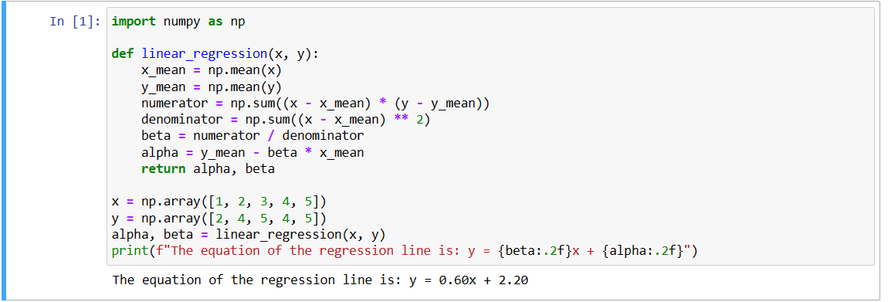

# Implementation of Univariate Linear Regression
## Aim:
To implement univariate Linear Regression to fit a straight line using least squares.
## Equipment’s required:
1.	Hardware – PCs
2.	Anaconda – Python 3.7 Installation / Moodle-Code Runner
## Algorithm:
1.	Get the independent variable X and dependent variable Y.
2.	Calculate the mean of the X -values and the mean of the Y -values.
3.	Find the slope m of the line of best fit using the formula.
 
4.	Compute the y -intercept of the line by using the formula:
  
5.	Use the slope m and the y -intercept to form the equation of the line.
6.	Obtain the straight line equation Y=mX+b and plot the scatterplot.
## Program
'''
 Implementation of Univariate Linear Regression
Developed by: S V SHADHANASHREE
RegisterNumber: 23013434
'''
```
import numpy as np

def linear_regression(x, y):
    x_mean = np.mean(x)
    y_mean = np.mean(y)
    numerator = np.sum((x - x_mean) * (y - y_mean))
    denominator = np.sum((x - x_mean) ** 2)
    beta = numerator / denominator
    alpha = y_mean - beta * x_mean
    return alpha, beta

# Example usage
x = np.array([1, 2, 3, 4, 5])
y = np.array([2, 4, 5, 4, 5])
alpha, beta = linear_regression(x, y)
print(f"The equation of the regression line is: y = {beta:.2f}x + {alpha:.2f}")
```
## Output


## Result
Thus the univariate Linear Regression was implemented to fit a straight line using least squares.
